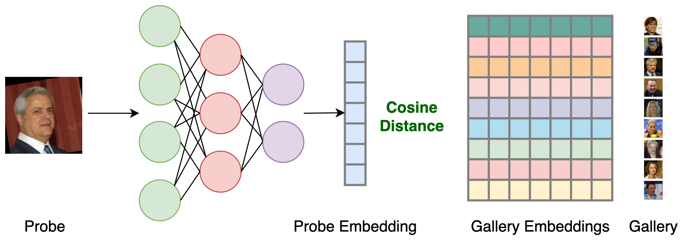

# Face-Recognition

This repository consists of code to fine-tune popular face-recognition architectures with LFW and QMUL-Survface datasets for evaluationg Low Resolution Face Recognition. This project is carried out as part of my Masters Thesis - ***"Bias and Fairness in Low Resolution Image Recognition"*** under the guidance of [Dr. Mayank Vatsa](http://home.iitj.ac.in/~mvatsa/) and [Dr. Richa Singh](http://home.iitj.ac.in/~richa/)

## Requirements:

Clone the repository
> git clone https://github.com/ksasi/face-recognition.git

Install using pip

> pip install -r requirements.txt

## Datasets:

| Dataset | Description                       
| :-------- |:-------------------------------- |
| [LFW](http://vis-www.cs.umass.edu/lfw/)|Labeled Faces in the Wild is a public benchmark that can be used for face recognition and verification.LFW deep funneled imagesconsists of LFW images aligned using deep funneling.|
| [QMUL-SurvFace](https://qmul-survface.github.io/)|This consists of native low-resolution face images. These are not synthesised by artificial down-sampling of high-resolution face images.|

## Architectures:

||
|:--:| 
| *Fine-tuning - Contrastive Loss*
*(LightCNN29, ArcFace, VGGFace2)* |

| Architecture | Description                       
| :-------- |:-------------------------------- |
| [LightCNN29](https://github.com/AlfredXiangWu/LightCNN)| This is a 29 layer CNN model, where a variation of maxout activation known as Max- Feature-Map (MFM) is introduced in each convolution layer. This is trained with large scale noisy face datasets such as CASIA-WebFace and MS-Celeb-1M in gray-scale.|
| [VGGFace2](https://github.com/ox-vgg/vgg_face2)|This is a resnet50 backbone trained with MS-Celeb-1M and the fine-tuned with VG- GFace2 dataset.|
| [ArcFace](https://github.com/deepinsight/insightface)|This is a resnet18 backbone pre-trained with MS1MV3 dataset with Arcface i.e. Additive angular margin loss for deep face recognition. |

||
|:--:| 
| *Inference*
*(LightCNN29, ArcFace, VGGFace2)* |

## Experimental Setup:

* Download pretrained model checkpoints for [LightCNN29](https://drive.google.com/drive/folders/1ZCMmzCMAV4SNEOioqsyQ8636fDZmXmDP?usp=sharing), [VGGFace2](https://drive.google.com/drive/folders/13yPfLesXoCMJ7M7B06wpQjB91FkIqiC3?usp=sharing) and [ArcFace](https://drive.google.com/drive/folders/1W2Ele9EzI-7QGjrU6iL6z6lMDhhsMjjI?usp=sharing)
* Place the checkpoint files in the **"models"** folder
* Download the Processed [LFW](https://drive.google.com/drive/folders/1uYXHjpriGQKSXj8dAOXODBU3KndYb_8h?usp=sharing) and [QMUL-SurvFace](https://drive.google.com/open?id=13ch6BPaexlKt8gXB_I8aX7p1G3yPm2Bl) datasets
* Uncompress the downloaded **lfw-deepfunneled_processed.tar.gz** and **QMUL-SurvFace-v1.zip** into the **data** folder
* Download and uncompress processed **mated_probe.zip** and processed **gallery.zip** into **"data/QMUL-SurvFace/Face\_Identification\_Test_Set"** location from [here](https://drive.google.com/drive/folders/10eLJIUpMTER_27tEjOvXDo-93FqJAvdB?usp=sharing)

## Fine-tuning and Evaluation Scripts:

fine_tune.sh script in scripts folder can be executed as shown below:

### Fine-tuning with LFW dataset

1. Fine-tune and Evaluate pretrained **LightCNN29** model with LFW dataset

   > sh fine_tune.sh LightCNN29 LFW

2. Fine-tune and Evaluate pretrained **VGGFace2** model with LFW dataset
   > sh fine_tune.sh VGGFace2 LFW

3. Fine-tune and Evaluate pretrained **ArcFace** model with LFW dataset
   > sh fine_tune.sh ArcFace LFW

### Fine-tuning with QMUL-SurvFace dataset

1. Fine-tune and Evaluate pretrained **LightCNN29** model with QMUL-SurvFace dataset
   > sh fine_tune.sh LightCNN29 SurvFace

2. Fine-tune and Evaluate pretrained **VGGFace2** model with QMUL-SurvFace dataset
   > sh fine_tune.sh VGGFace2 SurvFace

3. Fine-tune and Evaluate pretrained **ArcFace** model with QMUL-SurvFace dataset
   > sh fine_tune.sh ArcFace SurvFace

## Results:

#### Identification Accuracy:

|   **Model**   |  **Rank1** |  **Rank1**  | **Rank10** | **Rank10**   |
|   :--------:  |  :------:  |  :------:   |  :------:  |   :-----:    |
|  *Dataset*    |   *LFW*    |  *SurvFace* |   *LFW*    |  *SurvFace*  |
|  LightCNN29   |   96.8     |     6.3     |    98.6    |     15.2     |
|    VGGFace2   |   95.6     |     1.6     |    99.7    |      5.7     |
|     ArcFace   |   80.7     |     1.8     |    89.6    |      5.8     |

#### CMC Curves:

|||
|:--:|:--:| 
| *LightCNN29 - LFW* | *LightCNN29 - QMUL-SurvFace* |

|||
|:--:|:--:| 
| *VGGFace2 - LFW* | *VGGFace2 - QMUL-SurvFace* |

|||
|:--:|:--:| 
| *ArcFace - LFW* | *ArcFace - QMUL-SurvFace* |

## Contact:

For questions and clarifications, please contact [@ksasi](https://github.com/ksasi) or raise an issue on GitHub.

## References:

The code is adapted from the following repositories:

1. [Light CNN for Deep Face Recognition, in PyTorch](https://github.com/AlfredXiangWu/LightCNN)
2. [VGGFace2 Dataset for Face Recognition](https://github.com/ox-vgg/vgg_face2)
3. [InsightFace: 2D and 3D Face Analysis Project](https://github.com/deepinsight/insightface)
4. [PyTorch Metric Learning](https://kevinmusgrave.github.io/pytorch-metric-learning/losses/)

